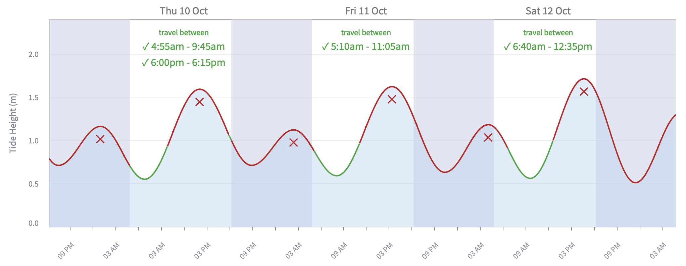
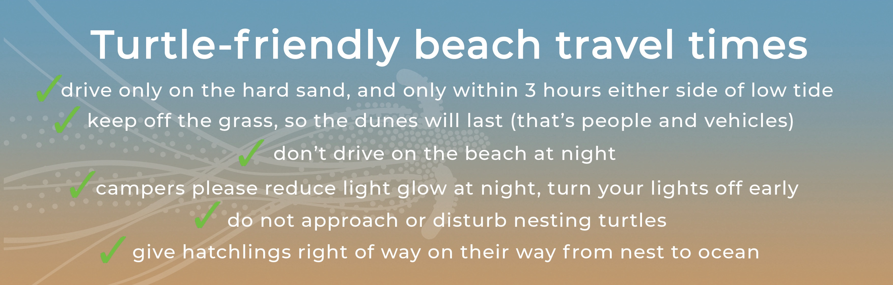

# BIEPA Tread Lightly
Showing tide times around Bribie Island and when it's best to avoid driving on the beach to protect wildlife,
including marine turtles that nest in the dunes on the National Park beach.

This is a [Streamlit](https://streamlit.io) application.

Running in Streamlit Community Cloud: https://biepa-tread-lightly.streamlit.app





## Getting Started
Create `.streamlit/secrets.toml` with access tokens:
```
[willy]
key = "API-key-from-willy-weather"
```

Run the app locally:
```commandline
streamlit run streamlit_app.py
```

The app should open in your browser at: http://localhost:8501

**Note:** You may need to enable HTTP URLs in your browser settings.